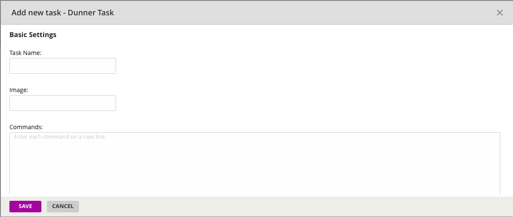
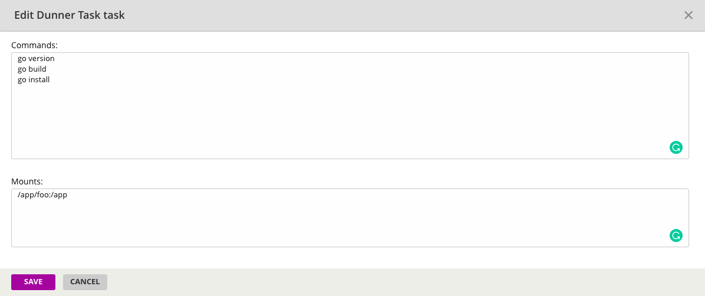
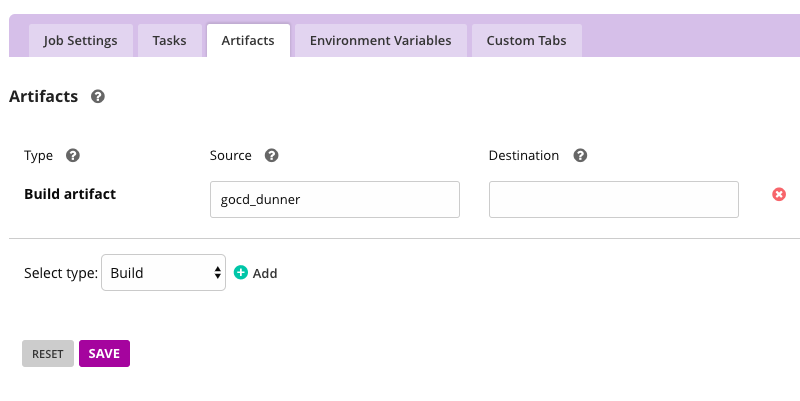
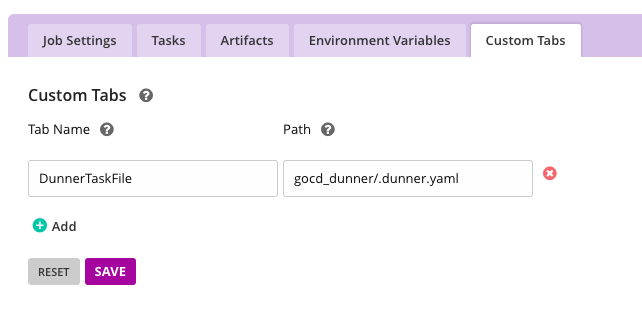

# dunner-gocd-plugin
[](https://travis-ci.org/leopardslab/dunner-gocd-plugin)

A [GoCD](https://gocd.org) task plugin for [Dunner](https://github.com/leopardslab/dunner).

## Installation

This plugin can be installed using the [GoCD standard plugin installation instructions](https://docs.gocd.org/current/extension_points/plugin_user_guide.html).

Download the latest jar file of this plugin from [Github Releases](https://github.com/leopardslab/dunner-gocd-plugin/releases) and copy it to the external plugins directory(`<go_server>/plugins/external`) of Go-Server. Restart your server to see the plugin added to GoCD.

## Task Configuration

* Select task type as `Dunner Task` when creating a new task in a build job. 

	

* Specify the image to be used, commands, mount directories, environment variable values in configuration.

	

* Enter each command, mount directory and env variable in a new line. By default project root directory will be mounted to container. If any additional mount directories are required, specify them in `Mounts` section. Example:

	

Each value should be specified as per [dunner usage](https://github.com/leopardslab/Dunner/wiki/User-Guide#how-to-write-a-dunner-file).

You can also specify the environment variables in GoCD job tab, it will be passed to dunner tasks.

* `Save` task.
* To be able to download dunner task file from pipeline configuration, add `gocd_dunner` directory as artifact and add `gocd_dunner/.dunner.yaml` to custom tab. This gives you direct link to download dunner task file for reference or to run task manually without GoServer.

	
	

## Support
* Go.cd: 17.3.0+ Note: This is only tested regularly against 17.3.0 and latest. This could potentially work with older versions, but not tested.
* Agent Requirements: Install Docker and Dunner.

### Build plugin from source

Requirements: Java, Gradle

* Clone this repository and run the below commands on command-line:

```
$ gradle clean install
$ gradle build
```

This will generate the plugin jar file named `dunner-gocd-plugin-<version>.jar` in the `<clone_repo_dir>/build/libs/` directory.

