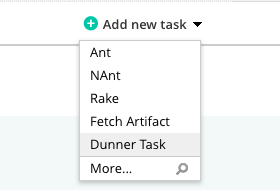

# dunner-gocd-plugin
A [GoCD](https://gocd.org) task plugin for [Dunner](https://github.com/leopardslab/dunner).

## Installation

This plugin can be installed using the [GoCD standard plugin installation instructions](https://docs.gocd.org/current/extension_points/plugin_user_guide.html).

Download the jar file of this plugin and copy it to the external plugins directory of Go-Server. Restart your server to see the plugin added to your GoCD.


## Task Configuration

* Select task type as `Dunner Task` when creating a new task in a build job. 



* Specify the image to be used, commands, mount directories, environment variable values in configuration.
* `Save` task.

## Support
* Go.cd: 17.3.0+ Note: This is only tested regularly against 17.3.0 and latest. This could potentially work with older versions, but not tested.
* Agent Requirements: Install Docker and Dunner.

### Build plugin from source

Requirements: Java, Gradle

* Clone this repository and run the below commands on command-line:

```
$ gradle clean install
$ gradle build
```

This will generate the plugin jar file named `dunner-gocd-plugin-<version>.jar` in the `<clone_repo_dir>/build/libs/` directory.

